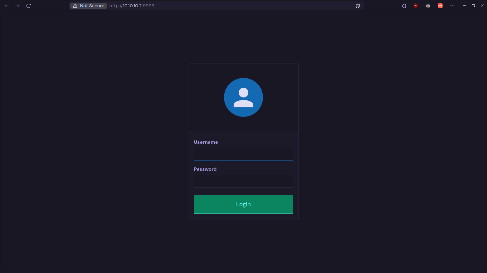
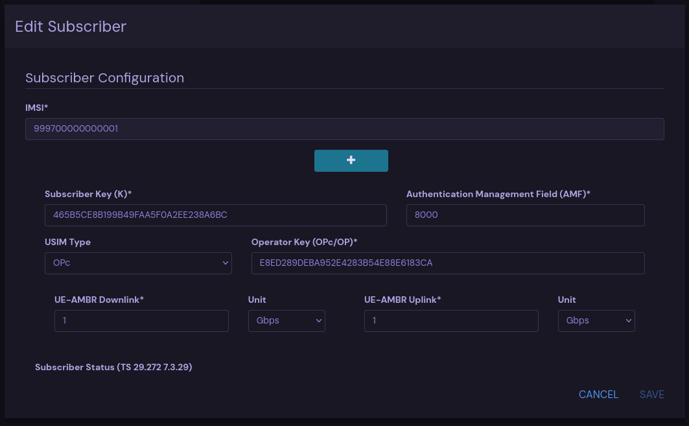
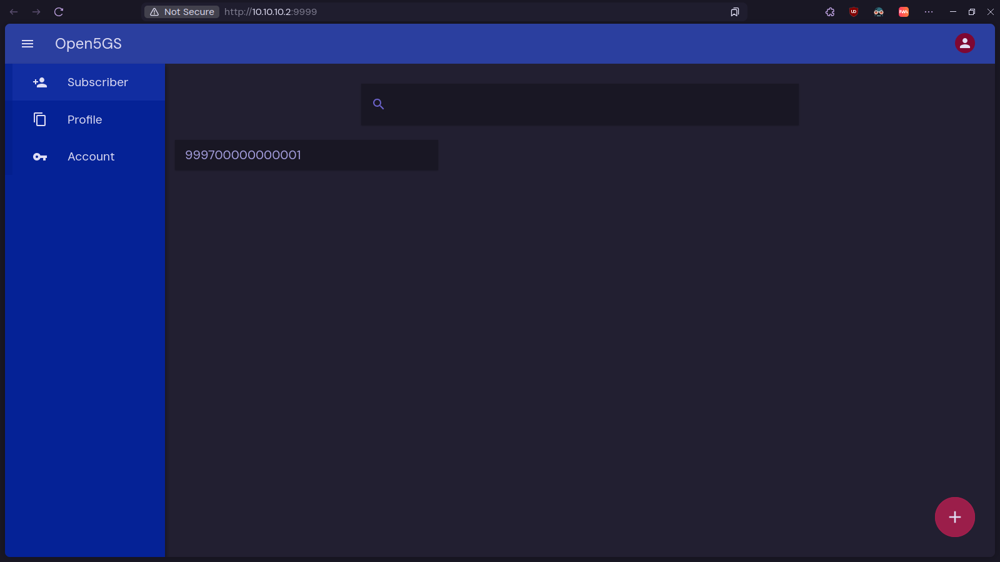

# Percobaan Open5GS & UERANSIM di VIrtualBox

## 1.1 Tujuan 

Untuk mengetahui cara kerja dari dasar Open5G dan UERANSIM, dengan penerapan menggunakan Virtual Machine.

## 1.2 Persiapan

### 1.2.1 Spesfikasi & Konfigurasi Jaringan Virtual Machine

| **Name**              | **vCPU** |  **RAM** | **Netwoking**                  | 
|-----------------------|----------|----------|--------------------------------|
| Open5GS - Ubuntu      | 2        | 4 GB     | NAT, Host-Only : 10.10.10.2    |
| UERANSIM - Ubuntu     | 1        | 2 GB     | NAT, Host-Only : 10.10.10.3    |

### 1.1.2 Software yang di gunakan

- VirtualBox
- Open5GS
- UERANSIM

## 1.3 Langkah - langkah

### 1.3.1 Server 1 : Open5GS - Ubuntu

#### Fase 1 : Install MongoDB

Impor kunci publik yang digunakan oleh sistem manajemen paket.

```bash
$ sudo apt update
$ sudo apt install gnupg
$ curl -fsSL https://pgp.mongodb.com/server-8.0.asc | sudo gpg -o /usr/share/keyrings/mongodb-server-8.0.gpg --dearmor
```

Buat file daftar /etc/apt/sources.list.d/mongodb-org-8.0.list untuk versi Ubuntu. Untuk Ubuntu 22.04 LTS :

```bash
$ echo "deb [ arch=amd64,arm64 signed-by=/usr/share/keyrings/mongodb-server-8.0.gpg] https://repo.mongodb.org/apt/ubuntu jammy/mongodb-org/8.0 multiverse" | sudo tee /etc/apt/sources.list.d/mongodb-org-8.0.list
```

Pasang paket MongoDB.

```bash
$ sudo apt update
$ sudo apt install -y mongodb-org
$ sudo systemctl start mongod 
$ sudo systemctl enable mongod
```

#### Fase 2 : Install Open5GS

Untuk Ubuntu, install dengan perintah : 

```bash
$ sudo add-apt-repository ppa:open5gs/latest
$ sudo apt update
$ sudo apt install open5gs
```

#### Fase 4 : Install NodeJS untuk WebvUI

Untuk menginstall gunakan perintah di bawah (Ubuntu) : 

```bash
$ sudo apt update
$ sudo apt install -y ca-certificates curl gnupg
$ sudo mkdir -p /etc/apt/keyrings
$ curl -fsSL https://deb.nodesource.com/gpgkey/nodesource-repo.gpg.key | sudo gpg --dearmor -o /etc/apt/keyrings/nodesource.gpg
$ NODE_MAJOR=20
$ echo "deb [arch=amd64 signed-by=/etc/apt/keyrings/nodesource.gpg] https://deb.nodesource.com/node_$NODE_MAJOR.x nodistro main" | sudo tee /etc/apt/sources.list.d/nodesource.list
```

Jalankan update dan install

```bash
 $ sudo apt update
 $ sudo apt install nodejs -y
```

#### Fase 5 : Install WebUI

Install Open5GS WebUI dengan perintah :

```bash
$ curl -fsSL https://open5gs.org/open5gs/assets/webui/install | sudo -E bash -
```

Karena WebUI nya masih di broadcast ke localhost, ubah dulu ke 0.0.0.0 agar bisa di akses melallui Host, atau beda network :

```bash
$ nano /usr/lib/node_modules/open5gs/server/index.js
```

Sebelumnya :

```javascript
process.env.DB_URI = process.env.DB_URI || 'mongodb://localhost/open5gs';

const _hostname = process.env.HOSTNAME || '127.0.0.1'; // Ubah bagian ini ke 0.0.0.0
const port = process.env.PORT || 9999;

const co = require('co');
```

Sesudah di ubah :

```javascript
process.env.DB_URI = process.env.DB_URI || 'mongodb://localhost/open5gs';

const _hostname = process.env.HOSTNAME || '0.0.0.0';
const port = process.env.PORT || 9999;

const co = require('co');
```

Lalu restart webui-server

```bash
$ sudo systemctl restart open5gs-webui
```

Dan pada akhirnya WebUI bisa di akses, dengan mengakses http://{IP-HOST}:9999 (Untuk tutorial lingkup ini bisa menggunakan http://10.10.10.2:9999)


#### Fase 6 : Mengatur Open5GS - AMF

Mengubah file konfigurasi AMF : 

```bash
$ sudo nano /etc/open5gs/amf.yaml
```

```yaml
amf:
  sbi:
    server:
      - address: 127.0.0.5
        port: 7777
    client:
#      nrf:
#        - uri: http://127.0.0.10:7777
      scp:
        - uri: http://127.0.0.200:7777
  ngap:
    server:
      - address: # IP Server 1
```

Jadi bisa di ubah : 

```yaml
amf:
  sbi:
    server:
      - address: 127.0.0.5
        port: 7777
    client:
#      nrf:
#        - uri: http://127.0.0.10:7777
      scp:
        - uri: http://127.0.0.200:7777
  ngap:
    server:
      - address: 10.10.10.2
```

Restart layanan AMF :

```bash
$ sudo systemctl restart open5gs-amfd
```

Mengecek apakah berjalan dengan melihat log :

```bash
$ sudo tail -f /var/log/open5gs/amf.log
```

Dan yang diharapkan bisa seperti di bawah ini :

```bash
hilmi@open5gs-ubuntu:~$ sudo tail -f /var/log/open5gs/amf.log
05/15 12:58:47.757: [sbi] INFO: Setup NF EndPoint(addr) [127.0.0.14:80] (../lib/sbi/context.c:2374)
05/15 12:58:47.757: [sbi] INFO: Setup NF EndPoint(addr) [127.0.0.14:7777] (../lib/sbi/context.c:2113)
05/15 12:58:47.910: [sbi] INFO: [574f62ec-318c-41f0-ad31-ff2ac77f43e9] (NRF-notify) NF registered (../lib/sbi/nnrf-handler.c:1140)
05/15 12:58:47.910: [sbi] INFO: [574f62ec-318c-41f0-ad31-ff2ac77f43e9] (NRF-notify) NF Profile updated [type:SMF] (../lib/sbi/nnrf-handler.c:1154)
05/15 12:58:47.910: [sbi] INFO: Setup NF EndPoint(addr) [127.0.0.4:80] (../lib/sbi/context.c:2374)
05/15 12:58:47.910: [sbi] INFO: Setup NF EndPoint(addr) [127.0.0.4:7777] (../lib/sbi/context.c:2113)
05/15 12:58:50.395: [sbi] INFO: [58d0676a-318c-41f0-b2dc-dfc802b4c29a] (NRF-notify) NF registered (../lib/sbi/nnrf-handler.c:1140)
05/15 12:58:50.395: [sbi] INFO: [58d0676a-318c-41f0-b2dc-dfc802b4c29a] (NRF-notify) NF Profile updated [type:PCF] (../lib/sbi/nnrf-handler.c:1154)
05/15 12:58:50.395: [sbi] INFO: Setup NF EndPoint(addr) [127.0.0.13:80] (../lib/sbi/context.c:2374)
05/15 12:58:50.395: [sbi] INFO: Setup NF EndPoint(addr) [127.0.0.13:7777] (../lib/sbi/context.c:2113)
```

#### Fase 7 : Mengatur Open5GS - UPF

Sekarang ubah konfigurasi UPF :

```bash
$ sudo nano /etc/open5gs/upf.yaml
```

```yaml
upf:
  pfcp:
    server:
      - address: 127.0.0.7
    client:
#      smf:     #  UPF PFCP Client try to associate SMF PFCP Server
#        - address: 127.0.0.4
  gtpu:
    server:
      - address: # IP Server 1 
```

Sehingga menjadi seperti ini :

```yaml
upf:
  pfcp:
    server:
      - address: 127.0.0.7
    client:
#      smf:     #  UPF PFCP Client try to associate SMF PFCP Server
#        - address: 127.0.0.4
  gtpu:
    server:
      - address: 10.10.10.2
```

Restart layanan UPF :

```bash
$ sudo systemctl restart open5gs-upfd
```

Mengecek apakah berjalan dengan melihat log :

```bash
$ sudo tail -f /var/log/open5gs/upf.log
```

Dan yang diharapkan bisa seperti di bawah ini :

```bash
hilmi@open5gs-ubuntu:~$ sudo tail -f /var/log/open5gs/upf.log
Open5GS daemon v2.7.5

05/15 12:58:47.657: [app] INFO: Configuration: '/etc/open5gs/upf.yaml' (../lib/app/ogs-init.c:144)
05/15 12:58:47.657: [app] INFO: File Logging: '/var/log/open5gs/upf.log' (../lib/app/ogs-init.c:147)
05/15 12:58:47.806: [metrics] INFO: metrics_server() [http://127.0.0.7]:9090 (../lib/metrics/prometheus/context.c:300)
05/15 12:58:47.806: [pfcp] INFO: pfcp_server() [127.0.0.7]:8805 (../lib/pfcp/path.c:30)
05/15 12:58:47.806: [gtp] INFO: gtp_server() [10.10.10.2]:2152 (../lib/gtp/path.c:30)
05/15 12:58:47.811: [app] INFO: UPF initialize...done (../src/upf/app.c:31)
05/15 12:58:47.907: [upf] INFO: PFCP associated [127.0.0.4]:8805 (../src/upf/pfcp-sm.c:168)
```

#### Fase 8 : Mengatur NAT Port Forwarding

Menambah NAT rule : 

```bash
$ sudo sysctl -w net.ipv4.ip_forward=1
$ sudo iptables -t nat -A POSTROUTING -j MASQUERADE -o enp0s3 # Disesuaikan lagi portnya
$ sudo systemctl stop ufw
$ sudo iptables -I FORWARD 1 -j ACCEPT
```

Simpan rule ke file konfigurasi :

```
$ sudo apt install iptables-persistent -y
$ sudo iptables-save > /etc/iptables/rules.v4
```

#### Fase 9 : Register Subscriber Information

Coba akses kembali melalui http://{IP-HOST}:9999 (Untuk tutorial lingkup ini bisa menggunakan http://10.10.10.2:9999) dengan memasukkan kredensial login :

```
Username : admin
Password : 1432
```



Untuk percobaan menggunakan 10.10.10.1:9999. Dan sekarang untuk percobaan, tambah subscriber menu dengan caranya :

1. Masuk ke menu Subscriber 
2. Klik tombol "+"
3. Isi data value :
    - IIMSI : 999700000000001
    - Subs Key : 465B5CE8B199B49FAA5F0A2EE238A6BC
    - USIM Type : OPc
    - Operator Key : E8ED289DEBA952E4283B54E88E6183CA
4. Lalu simpan.



Sehingga terlihat seperti ini : 



### 1.3.2 Server 2 : UERANSIM - Ubuntu

#### Fase 1 : Install Dependensi

Install dependensi yang akan digunakan : 

```bash
$ sudo apt update && sudo apt upgrade -y
$ sudo apt install make g++ libsctp-dev lksctp-tools iproute2
$ sudo snap install cmake --classic
```

Salin source code UERANSIM dan install :

```bash
$ git clone https://github.com/aligungr/UERANSIM.git
$ cd UERANSIM
$ make
```

#### Fase 2 : Setup gNB

Ubah file konfigurasi gNB :

```bash
$ nano config/open5gs-gnb.yaml
```

Isi/ ubah dengan mirip file seperti di bawah : 

```yaml
linkIp: 192.168.22.13
ngapIp: 192.168.22.13
gtpIp: 192.168.22.13

amfConfigs:
  - address: # IP Server 1 
    port: 38412
```

```yaml
linkIp: 192.168.22.13
ngapIp: 192.168.22.13
gtpIp: 192.168.22.13

amfConfigs:
  - address: 10.10.10.2 
    port: 38412
```

Mulai gNB dengan file config open5gs-gnb.yaml : 

```
./build/nr-gnb -c config/open5gs-gnb.yaml
```

> Pastikan file `open5gs-gnb.yaml` berjalan dan tidak di berhentikan ketika sedang digunakan. Disarankan untuk menjadikan prosess belakang.

Sehingga akan tampil seperti di bawah ini :

```bash
hilmi@ueransim-ubuntu:~/UERANSIM$ ./build/nr-gnb -c config/open5gs-gnb.yaml
UERANSIM v3.2.7
[2025-05-15 13:20:06.496] [sctp] [info] Trying to establish SCTP connection... (10.10.10.2:38412)
[2025-05-15 13:20:06.521] [sctp] [info] SCTP connection established (10.10.10.2:38412)
[2025-05-15 13:20:06.521] [sctp] [debug] SCTP association setup ascId[3]
[2025-05-15 13:20:06.522] [ngap] [debug] Sending NG Setup Request
[2025-05-15 13:20:06.533] [ngap] [debug] NG Setup Response received
[2025-05-15 13:20:06.533] [ngap] [info] NG Setup procedure is successful
```

#### Fase 3 : Setup UE

Ubah file konfigurasi UE :

```bash
$ nano config/open5gs-ue.yaml
```

Pastikan file konfigurasi diisi dengan keterangan seperti di bawah ini :

```yaml
supi: 'imsi-999700000000001'
mcc: '999'
mnc: '70'

key: '465B5CE8B199B49FAA5F0A2EE238A6BC'
op: 'E8ED289DEBA952E4283B54E88E6183CA'
opType: 'OPC'
amf: '8000'
imei: '356938035643803'
imeiSv: '4370816125816151'

gnbSearchList:
  - # IP Server 2
```

Sehingga menjadi :

```yaml
supi: 'imsi-999700000000001'
mcc: '999'
mnc: '70'

key: '465B5CE8B199B49FAA5F0A2EE238A6BC'
op: 'E8ED289DEBA952E4283B54E88E6183CA'
opType: 'OPC'
amf: '8000'
imei: '356938035643803'
imeiSv: '4370816125816151'

gnbSearchList:
  - 10.10.10.3
```

Lalu jalankan file `config/open5gs-ue.yaml`

```bash
$ sudo ./build/nr-ue -c config/open5gs-ue.yaml
```

> Pastikan file `open5gs-ue.yaml` berjalan dan tidak di berhentikan ketika sedang digunakan.

```bash
hilmi@ueransim-ubuntu:~/UERANSIM$ sudo ./build/nr-ue -c config/open5gs-ue.yaml
[sudo] password for hilmi: 
UERANSIM v3.2.7
[2025-05-15 13:21:48.590] [rrc] [debug] UE[1] new signal detected
                                                                 [2025-05-15 13:21:48.589] [nas] [info] UE switches to state [MM-DEREGISTERED/PLMN-SEARCH]
[2025-05-15 13:21:48.590] [rrc] [debug] New signal detected for cell[1], total [1] cells in coverage
[2025-05-15 13:21:48.590] [nas] [info] Selected plmn[999/70]
[2025-05-15 13:21:48.590] [rrc] [info] Selected cell plmn[999/70] tac[1] category[SUITABLE]
[2025-05-15 13:21:48.590] [nas] [info] UE switches to state [MM-DEREGISTERED/PS]
[2025-05-15 13:21:48.590] [nas] [info] UE switches to state [MM-DEREGISTERED/NORMAL-SERVICE]
[2025-05-15 13:21:48.590] [nas] [debug] Initial registration required due to [MM-DEREG-NORMAL-SERVICE]
[2025-05-15 13:21:48.594] [nas] [debug] UAC access attempt is allowed for identity[0], category[MO_sig]
[2025-05-15 13:21:48.594] [nas] [debug] Sending Initial Registration
[2025-05-15 13:21:48.595] [nas] [info] UE switches to state [MM-REGISTER-INITIATED]
[2025-05-15 13:21:48.595] [rrc] [debug] Sending RRC Setup Request
[2025-05-15 13:21:48.596] [rrc] [info] RRC Setup for UE[1]
                                                          [2025-05-15 13:21:48.596] [rrc] [info] RRC connection established
[2025-05-15 13:21:48.596] [rrc] [info] UE switches to state [RRC-CONNECTED]
[2025-05-15 13:21:48.596] [nas] [info] UE switches to state [CM-CONNECTED]
[2025-05-15 13:21:48.597] [ngap] [debug] Initial NAS message received from UE[1]
                                                                                [2025-05-15 13:21:48.607] [nas] [debug] Authentication Request received
[2025-05-15 13:21:48.607] [nas] [debug] Received SQN [000000000081]
[2025-05-15 13:21:48.607] [nas] [debug] SQN-MS [000000000000]
[2025-05-15 13:21:48.613] [nas] [debug] Security Mode Command received
[2025-05-15 13:21:48.613] [nas] [debug] Selected integrity[2] ciphering[0]
[2025-05-15 13:21:48.629] [ngap] [debug] Initial Context Setup Request received
                                                                               [2025-05-15 13:21:48.630] [nas] [debug] Registration accept received
[2025-05-15 13:21:48.630] [nas] [info] UE switches to state [MM-REGISTERED/NORMAL-SERVICE]
[2025-05-15 13:21:48.630] [nas] [debug] Sending Registration Complete
[2025-05-15 13:21:48.630] [nas] [info] Initial Registration is successful
[2025-05-15 13:21:48.630] [nas] [debug] Sending PDU Session Establishment Request
[2025-05-15 13:21:48.630] [nas] [debug] UAC access attempt is allowed for identity[0], category[MO_sig]
[2025-05-15 13:21:48.835] [nas] [debug] Configuration Update Command received
[2025-05-15 13:21:48.855] [ngap] [info] PDU session resource(s) setup for UE[1] count[1]
                                                                                        [2025-05-15 13:21:48.855] [nas] [debug] PDU Session Establishment Accept received
[2025-05-15 13:21:48.855] [nas] [info] PDU Session establishment is successful PSI[1]
[2025-05-15 13:21:48.876] [app] [info] Connection setup for PDU session[1] is successful, TUN interface[uesimtun0, 10.45.0.2] is up.
```

Dan didapatkan pesan :

```bash
TUN interface[uesimtun0, 10.45.0.2] is up.
```

Yang dimana pesan terkait sistem membuat interface di `uesimtun0`.

#### Fase 4 : Uji Coba Jaringan 5G 

Coba ping melalui interface uesimtun0 : 

```bash
$ ping -I uesimtun0 google.com
```
```bash
hilmi@ueransim-ubuntu:~$ ping -I uesimtun0 google.com
PING google.com (74.125.24.139) from 10.45.0.2 uesimtun0: 56(84) bytes of data.
64 bytes from sf-in-f139.1e100.net (74.125.24.139): icmp_seq=56 ttl=254 time=21.8 ms
64 bytes from sf-in-f139.1e100.net (74.125.24.139): icmp_seq=57 ttl=254 time=21.4 ms
64 bytes from sf-in-f139.1e100.net (74.125.24.139): icmp_seq=58 ttl=254 time=20.7 ms
64 bytes from sf-in-f139.1e100.net (74.125.24.139): icmp_seq=59 ttl=254 time=42.9 ms
64 bytes from sf-in-f139.1e100.net (74.125.24.139): icmp_seq=60 ttl=254 time=21.5 ms
64 bytes from sf-in-f139.1e100.net (74.125.24.139): icmp_seq=61 ttl=254 time=20.5 ms
64 bytes from sf-in-f139.1e100.net (74.125.24.139): icmp_seq=62 ttl=254 time=20.5 ms
64 bytes from sf-in-f139.1e100.net (74.125.24.139): icmp_seq=63 ttl=254 time=21.4 ms
64 bytes from sf-in-f139.1e100.net (74.125.24.139): icmp_seq=64 ttl=254 time=20.6 ms
64 bytes from sf-in-f139.1e100.net (74.125.24.139): icmp_seq=65 ttl=254 time=20.6 ms
```

> Disesuaikan lagi adapter yang diberikan oleh sistem. `uesimtun0` merupakan hasil adapter yang di berikan oleh sistem pada sebelumnya.


Terlihat bahwa sistem bisa tersambung, dan percobaan berhasil.

Coba akses data melalui `curl` : 

```bash
$ sudo apt install curl -y
$ curl --interface uesimtun0 -X GET "https://httpbin.org/get"
```
Sehingga bisa di dapat : 
```
hilmi@ueransim-ubuntu:~$ curl --interface uesimtun0 -X GET "https://httpbin.org/get"
<html>
<head><title>503 Service Temporarily Unavailable</title></head>
<body>
<center><h1>503 Service Temporarily Unavailable</h1></center>
</body>
</html>
```
Ya, contoh berhasil, dan ya percobaan selesai. 

